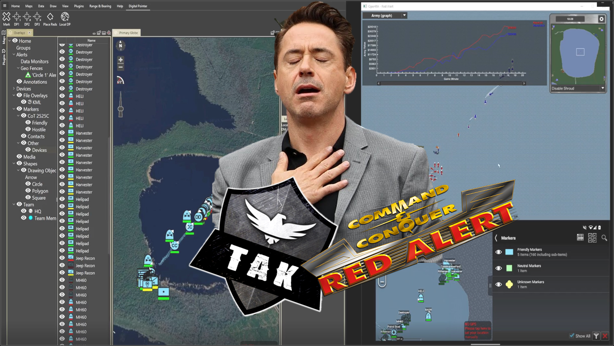

# OpenRA - Community Support

A Libre/Free Real Time Strategy game engine supporting early Westwood classics.

* Website: [https://www.openra.net](https://www.openra.net)
* Chat: [#openra on Libera](ircs://irc.libera.chat:6697/openra) ([web](https://web.libera.chat/#openra)) or [Discord](https://discord.openra.net) 
* Repository: [https://github.com/OpenRA/OpenRA](https://github.com/OpenRA/OpenRA) 

## Get Started with OpenRA to TAKX with Step-by-Step Instructions.

1. Extract OpenRA_For_TAKX-main (Tested on TAKX 5.5)
2. Open OpenRA_For_TAKX-main until you see OpenRA contents  (.editorconfig, .gitignore, etc)
3. Shift+Right-Click in the window and click “Open PowerShell Window here”. A powershell window will open.
4. Copy, paste, execute in Powershell -> cmd /c launch-game.cmd Game.Mod=ra
5. Click "Quick install," Follow the prompts, next, next, next (everything is set up for default). Close OpenRA after the install is complete. Full install indcates that you have Single and Multiplayer avalible as a selction.
6. Copy the “4Ponds.oramap” from the "GeoMaps" folder and Paste it here -> C:\Users\FirstnameLastname\AppData\Roaming\OpenRA\maps\ra\{DEV_VERSION}
"AppData" is hidden by default. To unhide it, right-click on the folder and select "Properties". In the "Attributes" section, uncheck "Hidden" and click "Apply".
7. Redo steps 2 -4 then continue with step 8
8. Click SinglePlayer -> Skirmish - Change Map -> Custom Maps (4 Ponds) -> ok

OpenRA is set for localhost CoT messaging. Open TAKX or WinTAKX on the same computer as OpenRA and you will automatically see CoT Data populate. 

Note: TAKX was tested for this project, WinTAK and ATAK may show different results.

## Play

Distributed mods include a reimagining of

* Command & Conquer: Red Alert
* Command & Conquer: Tiberian Dawn
* Dune 2000

EA has not endorsed and does not support this product.

Check our [Playing the Game](https://github.com/OpenRA/OpenRA/wiki/Playing-the-game) Guide to win multiplayer matches.

## Contribute

* Please read [INSTALL.md](https://github.com/OpenRA/OpenRA/blob/bleed/INSTALL.md) and [Compiling](https://github.com/OpenRA/OpenRA/wiki/Compiling) on how to set up an OpenRA development environment.
* See [Hacking](https://github.com/OpenRA/OpenRA/wiki/Hacking) for a (now very outdated) overview of the engine.
* Read and follow our [Code of Conduct](https://github.com/OpenRA/OpenRA/blob/bleed/CODE_OF_CONDUCT.md).
* To get your patches merged, please adhere to the [Contributing](https://github.com/OpenRA/OpenRA/blob/bleed/CONTRIBUTING.md) guidelines.

## Mapping

* We offer a [Mapping](https://github.com/OpenRA/OpenRA/wiki/Mapping) Tutorial as you can change gameplay drastically with custom rules.
* For scripted mission have a look at the [Lua API](https://docs.openra.net/en/release/lua/).
* If you want to share your maps with the community, upload them at the [OpenRA Resource Center](https://resource.openra.net).

## Modding

* Download a copy of the [OpenRA Mod SDK](https://github.com/OpenRA/OpenRAModSDK) to start your own mod.
* Check the [Modding Guide](https://github.com/OpenRA/OpenRA/wiki/Modding-Guide) to create your own classic RTS.
* There exists an auto-generated [Trait documentation](https://docs.openra.net/en/latest/release/traits/) to get started with yaml files.
* Some hints on how to create new OpenRA compatible [Pixelart](https://github.com/OpenRA/OpenRA/wiki/Pixelart).
* Upload total conversions at [our Mod DB profile](https://www.moddb.com/games/openra/mods).

## Support

* Sponsor a [mirror server](https://github.com/OpenRA/OpenRAWebsiteV3/tree/master/packages) if you have some bandwidth to spare.
* You can immediately set up a [Dedicated](https://github.com/OpenRA/OpenRA/wiki/Dedicated-Server) Game Server.

## License
Copyright (c) OpenRA Developers and Contributors
This file is part of OpenRA, which is free software. It is made
available to you under the terms of the GNU General Public License
as published by the Free Software Foundation, either version 3 of
the License, or (at your option) any later version. For more
information, see [COPYING](https://github.com/OpenRA/OpenRA/blob/bleed/COPYING).

